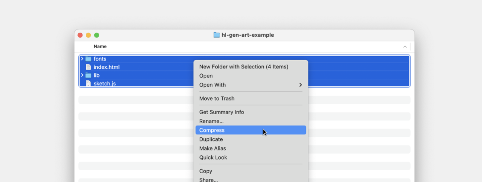

# 🦣 MammothArt: NFT-Powered Generative Art Platform

> Where your existing NFTs shape the art you mint


## 🌟 Experience MammothArt

### 🔥 Live Demo
Check out our platform in action: [https://mammoth-bros-frontend-production.up.railway.app/](https://mammoth-bros-frontend-production.up.railway.app/)

### 🧬 NFT-Weighted Rarity System
Your existing MammothArt NFTs influence the probability of minting rare pieces:
- Stack multiple NFTs for higher chances
- Unlock special trait combinations
- Build strategic collections

### 🎨 For Artists
- Submit generative art collections
- Define trait inheritance rules
- Set rarity tiers and probabilities

### 👾 For Collectors
- Use existing NFTs as "trait boosters"
- View rarity chances before minting

## 💎 Revenue Structure
| Party | Fee | Purpose |
|-------|-----|---------|
| Artists | 5 TIA | Collection submission |
| Collectors | 2% | Per mint |

### 📸 Preview Screenshots
| Home Page | Minting Interface | Collection View |
|-----------|------------------|-----------------|
|  |  |  |


## 🚀 Getting Started

1. **Connect Your Wallet**
   - Support for MetaMask, WalletConnect, and more
   - Automatic NFT detection

2. **Browse Collections**
   - Filter by artist, style, or rarity
   - View detailed collection stats

3. **Start Minting**
   - Mint new pieces

## 📦 Set up your own generative art collection

### Project Structure
Generative art collections on MammothArt are simply packaged web pages that use data inputs to render visual outputs. Projects should contain the following:

- **index.html** (required): This file displays your tokens
- **hl-gen.js** (required): This file gives you access to data from the blockchain, helps you generate deterministic randomness in your tokens, and provides methods to set metadata and capture preview images
- Any libraries required to render your tokens, like p5.js, three.js, tone.js, etc.
- Any other files required to render your tokens, including images, fonts, video files, etc.
Note that, in general, you should not reference external libraries or files, as these references may break in the future. Any resource your project needs to display properly should be included locally.

For example, a simple project using p5.js might look like this:
```
index.html
sketch.js
lib/
  ↳ p5.min.js
  ↳ hl-gen.js
fonts/
  ↳ IBMPlexMono-Regular.ttf
textures/
  ↳ texture-1.png
  ↳ texture-2.png
```

### Submit your collection
Once you're ready to test or deploy your project on MammothArt:

- Create a .zip of your project files, ensuring that you select the group of files to zip, not the folder itself:

- Your .zip should not be larger than 2GB. All project assets are stored on Arweave by default, a decentralized and permanent storage network.
- Go to [https://mammoth-bros-frontend-production.up.railway.app/](https://mammoth-bros-frontend-production.up.railway.app/) and connect your wallet.
- Click Create and upload the .zip file of your code-based generative project and continue with testing.

### Example Collections
Download our example collections to get started:
- [Basic Example](/zip/BASIC-P5-EXAMPLE.zip)
- [Basic Studio Example](/zip/BASIC-STUDIO-EXAMPLE.zip)
- [Advanced Example](/zip/ADVANCED-P5-EXAMPLE.zip)

## 🔗 Quick Links
- [P5.js Documentation](https://p5js.org/reference/)
- [Forma Documentation](https://docs.forma.art/)
- [Modularium API](https://modularium-api.sketchpad-1.forma.art/)
- [Platform Overview (coming soon)]()
- [Artist Guidelines (coming soon)]()
- [Collector Guide (coming soon)]()
- [FAQ (coming soon)]()

## 📬 Contact & Support

- Twitter: [@MammothBros](https://twitter.com/MammothBros){target="_blank"}


## 🎨 Featured Collections
*Coming soon - showcase of top collections and artists*

## 📊 Platform Statistics
*Coming soon - live platform metrics and analytics*
